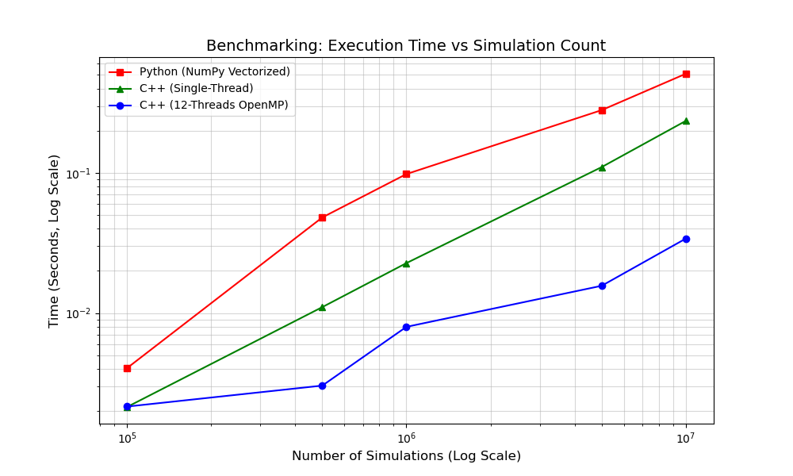
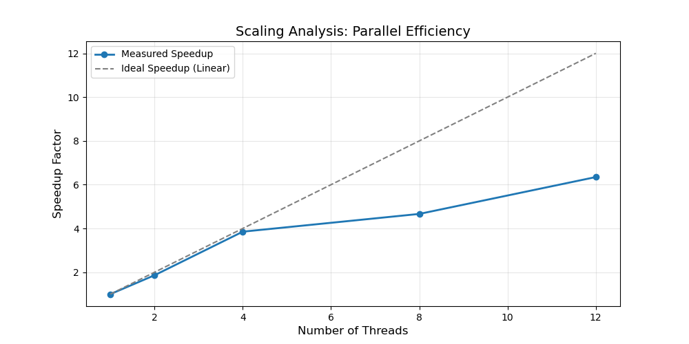
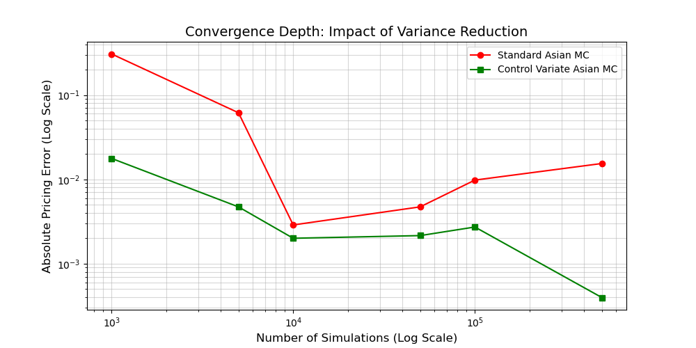

# 基于 C++ 的高性能蒙特卡洛 (Monte Carlo) 期权定价引擎

本项目是一个针对欧式、亚式及美式期权定价的高性能量化计算内核。项目实现了从随机微分方程（SDE）离散化建模到底层 C++ 并行优化的全流程，旨在通过数学算法优化与高性能计算技术，解决路径依赖衍生品模拟中“精度”与“速度”的权衡问题。

## 核心技术架构

1.  **混合编程**：基于 **C++20** 开发核心引擎，通过 **pybind11** 导出 Python 接口，兼顾底层算力与交互研究灵活性。
2.  **方差缩减 (CV)**：针对算术平均亚式期权，引入几何平均解析解作为控制变量，显著降低模拟方差。
3.  **动态规划 (LSMC)**：实现 **Longstaff-Schwartz** 算法，通过最小二乘回归确定美式期权最优行权边界。
4.  **HPC 优化**：利用 **OpenMP** 实现多线程并行，并采用 **Thread-local RNG** 方案确保并行路径生成的统计独立性。

## 数值实验与消融实验结果

以下实验数据均在 12 核处理器环境下测得。

### 1. 计算性能基准 (C++ vs. NumPy)
在 $10^7$ 次大规模欧式期权路径模拟中，C++ 引擎展现了显著的性能优势。

| 模拟条数 | NumPy 耗时 | C++ (单线程) | C++ (12 线程) | 提升倍数 |
| :--- | :--- | :--- | :--- | :--- |
| $10^6$ | 0.1025s | 0.0206s | 0.0050s | 20.5x |
| $10^7$ | 0.4957s | 0.2185s | **0.0351s** | **14.12x** |

### 2. 多核并行效率 (HPC Scaling)
通过 OpenMP 优化，系统能够有效利用硬件多核资源。

| 线程数 | 执行时间 | 加速比 (Measured Speedup) |
| :--- | :--- | :--- |
| 1 | 0.2296s | 1.00x |
| 4 | 0.0756s | 3.04x |
| 12 | **0.0364s** | **6.31x** |

### 3. 数学收敛性分析 (控制变量消融实验)
针对算术平均亚式期权，对比标准蒙特卡洛与引入控制变量（CV）后的精度表现。

| 模拟次数 | 标准 MC 误差 | 控制变量 (CV) 误差 | 精度提升倍数 |
| :--- | :--- | :--- | :--- |
| 1,000 | 0.307617 | 0.017739 | 17.3x |
| 500,000 | 0.015432 | **0.000397** | **38.87x** |

### 4. 美式期权定价 (LSMC 验证)
通过 Longstaff-Schwartz 算法处理最优停止问题，验证美式期权的早期行权溢价（Early Exercise Premium）。

*   **欧式看跌期权 (BS 解析解)**：5.573526
*   **美式看跌期权 (LSMC 模拟解)**：**5.577144**
*   **LSMC 10万次模拟耗时**：0.4304s

---

## 项目结构
*   `include/`: 定价器与回归工具头文件
*   `src/`: 核心算法逻辑与 Python 绑定实现
*   `python/`: 消融实验脚本与绘图代码
*   `docs/`: 性能图表与详细技术文档

## 编译环境要求
*   支持 C++20 的编译器 (MSVC 2019+ / GCC 10+)
*   CMake 3.15+
*   Python 3.8+ (需安装 `pybind11` 及 `matplotlib`)

